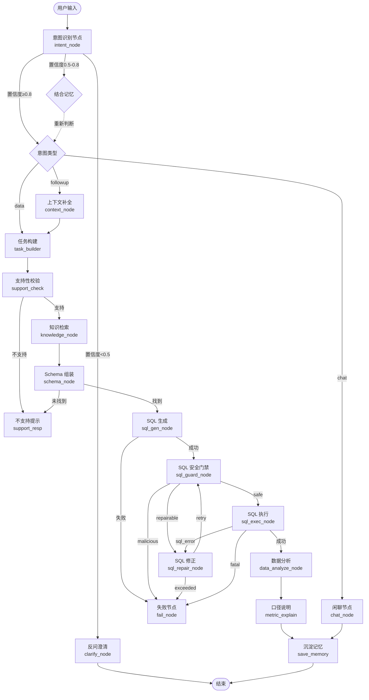

# CoT 自主决策流程图解

> 快速参考指南 | 面向开发者

---

## 决策流程总图（Mermaid）



---

## 状态字段矩阵（ChatBIState）

| 字段 | 类型 | 说明 |
|------|------|------|
| `messages` | `list` | 对话历史 |
| `user_id` | `str` | 用户标识 |
| `mode` | `"quick" \| "deep"` | 快速问答/深度思考 |
| `allowed_tables` | `list[str]` | 允许访问的表 |
| `intent` | `Optional[str]` | 意图类型 |
| `confidence` | `Optional[float]` | 置信度 0.0~1.0 |
| `user_memories` | `list[dict]` | 用户记忆 |
| `resolved_query` | `Optional[str]` | 解析后的问题 |
| `bi_task` | `Optional[str]` | BI 分析任务 |
| `knowledge_context` | `Optional[str]` | 知识检索结果 |
| `schema_context` | `Optional[str]` | Schema 上下文 |
| `sql` | `Optional[str]` | 生成的 SQL |
| `guard_result` | `Optional[str]` | **三态**：safe/repairable/malicious |
| `sql_error` | `Optional[str]` | SQL 错误信息 |
| `repair_count` | `int` | 修正次数（上限3） |
| `query_result` | `Optional[str]` | 查询结果 |
| `analysis` | `Optional[str]` | 快速分析结果 |
| `echart_option` | `Optional[str]` | ECharts 配置 |
| `deep_report` | `Optional[str]` | 深度分析报告 |
| `metric_explanation` | `Optional[str]` | 指标口径说明 |

---

## 条件路由速查表

```python
# edges.py

def route_after_intent(state) -> str:
    if state["intent"] == "chat":
        return "chat"
    if state.get("confidence", 1.0) < 0.5:
        return "clarify"
    if state["intent"] == "followup":
        return "followup"
    return "data"

def route_after_support(state) -> str:
    return "supported" if state.get("bi_task") else "unsupported"

def route_after_schema(state) -> str:
    return "found" if state.get("schema_context") else "not_found"

def route_after_sql_gen(state) -> str:
    return "success" if state.get("sql") else "error"

def route_after_guard(state) -> str:
    return state.get("guard_result", "repairable")

def route_after_repair(state) -> str:
    max_repairs = int(os.getenv("MAX_SQL_REPAIR_COUNT", "3"))
    return "exceeded" if state["repair_count"] >= max_repairs else "retry"

def route_after_exec(state) -> str:
    if state.get("query_result"):
        return "success"
    if state.get("sql_error") and state["repair_count"] < 3:
        return "sql_error"
    return "fatal"
```

---

## SQL 自愈循环详情

```
                    ┌─────────────────┐
                    │   SQL 生成      │
                    │  sql_gen_node   │
                    └────────┬────────┘
                             │
                             ▼
                    ┌─────────────────┐
                    │   SQL 安全门禁  │
                    │  sql_guard_node │
                    └────────┬────────┘
                             │
          ┌──────────────────┼──────────────────┐
          ▼                  ▼                  ▼
   ┌─────────────┐    ┌─────────────┐    ┌─────────────┐
   │    safe    │    │ repairable  │    │  malicious  │
   └──────┬──────┘    └──────┬──────┘    └──────┬──────┘
          │                  │                  │
          ▼                  │                  ▼
   ┌─────────────┐           │           [系统拒绝]
   │ SQL 执行    │           │
   │ sql_exec    │           │
   └──────┬──────┘           │
          │                  │
          ├──────────────────┘
          │           ┌──────▼──────┐
          │           │  SQL 修正    │
          │           │sql_repair   │
          │           └──────┬──────┘
          │                  │
          │    ┌─────────────┼─────────────┐
          │    ▼             ▼             ▼
          │ [retry ≤3]   [retry ≤3]   [exceeded]
          │    │             │             │
          │    └─────────────┴─────────────┘
          │              │
          └──────────────┘
```

**关键环境变量**：
```env
MAX_SQL_REPAIR_COUNT=3  # SQL 修正上限次数
```

---

## Dify 工作流节点映射

| Dify 节点 ID | 节点名称 | LangGraph 对应 |
|-------------|---------|---------------|
| 1777346712277 | 意图识别 LLM | intent_node |
| 1777347095066 | 意图分支 if-else | route_after_intent |
| 1750061504284 | AI 生成 SQL | sql_gen_node |
| 1750061971446 | 首次 SQL 执行 | sql_exec_node |
| 1759047065164 | SQL 修正节点 | sql_repair_node |
| 17590471368830 | 第二次 SQL 执行 | sql_exec_node (重试) |
| 1753246006785 | SQL 数据判断 | route_after_guard |
| 17604106355820 | 数据解读 | data_analyze_node |
| 17604107398820 | 大模型写口径 | metric_explain |

---

## 前端思维组件状态

```javascript
// 思维步骤状态机
const ThinkingStepStatus = {
    PENDING: 'pending',    // 等待中（灰色半透明）
    RUNNING: 'running',    // 进行中（蓝色脉冲）
    DONE: 'done',          // 已完成（黑色对勾）
    WARNING: 'warning'     // 警告（橙色闪烁）
};

// 步骤数据结构
const thinkingStep = {
    id: 'step_1',
    status: ThinkingStepStatus.RUNNING,
    icon: '🔍',
    title: '意图识别',
    description: '正在分析您的需求...',
    duration: null,  // 完成后显示耗时
    result: null     // 完成后显示结果摘要
};
```

---

## 快速调试命令

```bash
# 查看当前 LangGraph 状态
# 在 graph/builder.py 中添加日志

import logging
logging.basicConfig(level=logging.DEBUG)

# 追踪条件路由
def route_after_guard(state):
    result = state.get("guard_result", "repairable")
    logging.debug(f"[route_after_guard] guard_result={result}")
    return result
```

---

*最后更新：2026-05-21*
