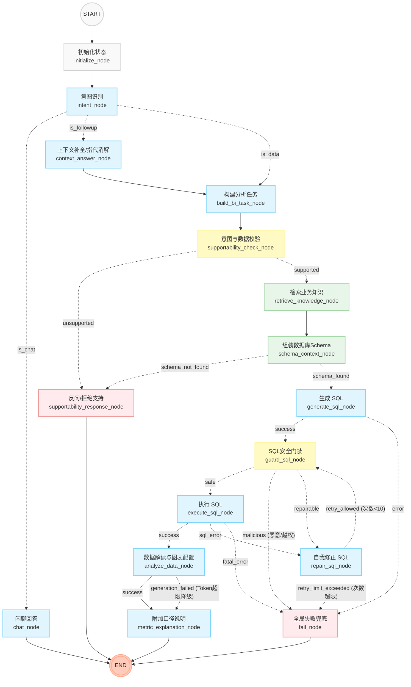

# ChatBI LangGraph 流程图设计 (优化版)

这份文档基于对原流程图的 10 次逻辑推演，修复了原图中的安全漏洞、上下文绕过问题、缺失的短路机制，以及大模型解读数据的容错降级设计。

## 流程图 (Mermaid)

您可以安装 Markdown Preview Mermaid 插件（VS Code）或者将下方的代码复制到 [Mermaid Live Editor](https://mermaid.live/) 查看高清图表。

## 主要架构改进亮点

1. **上下文补全前置化（防止绕过卫士）**：
   原图中，如果用户触发追问（followup），将补全上下文然后直接跳到查库并生成 SQL。新版设计中，`context_answer_node` 提取到了最前面（由意图节点路由）。一旦它把问题补全（例如“那华东区呢” -> “华东区的销售额是多少”），数据流会重新汇入 `build_bi_task_node` 并经受合规性校验。
2. **恶意 SQL 熔断机制**：
   在 `guard_sql_node` 加入了一条专门通往 `fail_node` 的红线。如果用户使用 Prompt 注入，诱导模型生成 `DELETE` 或者尝试查阅敏感表，安全门禁绝不尝试“修复（repair）”它，而是果断拦截并报错。
3. **闭环修复上限控制**：
   明确了 `repair_sql_node` 的输出必定流回 `guard_sql_node` 以确保安全。同时，为了防止反复陷入死循环，在边逻辑里增加 `retry_limit_exceeded` 判断（您的系统中可将其变量设为 10）。
4. **无 Schema 时的短路设计 (Fail Fast)**：
   如果在 `schema_context_node` 阶段发现提取不到任何有效的表，不要再傻傻地交给 `generate_sql_node` 让模型凭空捏造 SQL，而是直接跳转到 `supportability_response_node` 告诉用户“我不懂这块业务”。
5. **大规模数据容错降级 (Graceful Degradation)**：
   如果 `execute_sql_node` 查出了十万行数据，传给 `analyze_data_node` 必然会因为 Context 过大而崩溃。此时，如果分析失败，系统会触发 `generation_failed` 分支跨越错误，直接流向 `metric_explanation_node`。用户至少能看到一张包含原始数据的表格和指标定义，而不是一整页的 500 系统报错。
