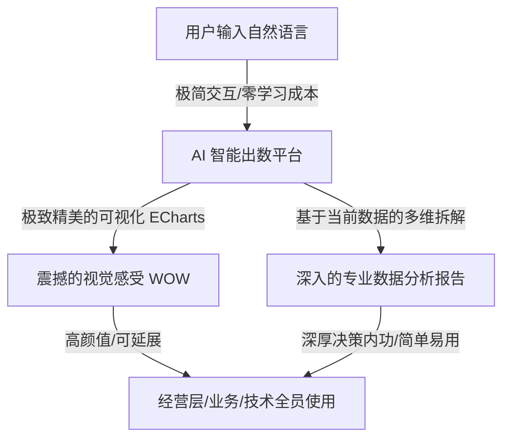

# GAC International ChatBI Workspace 2.0
## 用户需求调研与头脑风暴备忘录 (User Requirements & Brainstorming Log)

> **调研对象（用户）**: GAC 业务决策与产品负责人 (The USER)
> **调研顾问（AI）**: Antigravity (Google DeepMind 团队研发)
> **日期**: 2026-05-17
> **终极定位**：以“AI 智能出数”为底座，融合“极致精美的数据可视化”与“基于当前数据的深度分析报告”，打造一款**极简、可延展且极具震撼感**的企业级 AI 数据智能平台。

---

## 1. 产品核心痛点与定位重构

在本次深挖中，用户（产品主理人）对产品的**核心愿景与方向进行了升华和校准**：



### 1.1 核心痛点剖析
*   **痛点一：写材料/PPT 极其困难**。无论是经营层做决策汇报，还是业务部门做销售分析，都需要海量、精准且格式美观的数据。而在写汇报 PPT 时，寻找、提取、整理这些数据往往占用 80% 的时间。
*   **痛点二：传统 BI 门槛太高**。Tableau、PowerBI 等工具要求用户必须理解数据库的“维度（Dimension）”和“指标（Metric）”，才能进行复杂的拖拽加工。对于非技术出身 of 经营层 and 业务人员来说，学习成本高如天堑。
*   **痛点三：ETL 需求排队严重**。当业务人员做不出图表时，只能将需求提单给 ETL 技术团队。这导致技术团队被琐碎的取数需求淹没，业务团队也因为几张销量表格要等上数天甚至数周，时效性极差。

---

## 2. 震撼感与极简延展的交互设计脑暴

### 🎨 1. 双栏流式布局：由简入深的“延展”交互
- **平时（极简聊天态）**：
  整个页面是一个极其干净、高级的对话流。背景是微透的毛玻璃与极光渐变。没有复杂的功能堆砌，只有一个智能输入框 and 常用推荐问题卡片。
- **出数时（画布延展态）**：
  当用户提问后，AI 开始输出。右侧以流畅的滑动动画**优雅延展出一个“交互式数据画布（Data Canvas）”**。
  - 画布上方是**极其精美、支持 Hover/缩放的 ECharts 可视化图表**；
  - 画布中间是**结构化、支持表头排序的明细表格**；
  - 画布下方是**深度分析报告**（以结构化的 Markdown 格式排版，包含“核心现状”、“数据拆解”、“策略建议”）。

---

## 3. 核心细节调研清单

为了让重造的原型贴合广汽实际，我们整理了四个关键维度的“细节求证”，用户反馈后将实时更新入系统设计。

1.  **车型与指标细化**：是否加入“批发量”、“终端零售量”、“海运在途量/天数”等高价值指标，及“传祺 M8、埃安 AION Y”等主推车型。
2.  **报告叙事框架**：采用“现状 -> 车型及区域原因拆解 -> 调拨去库存经营建议”逻辑，辅助以同比/环比与年度达成率分析。
3.  **演示黄金动线（Demo User Journey）**：配置“大盘概览 ➔ 库存预警 ➔ 经营分析长报告”三步递进演示问题链。
4.  **内网部署环境约束**：是否要求 100% 局域网物理隔离（无公网），决定了图表与字体库的本地静态化打包级别。

---

## 4. Dify 流程深度剖析与“多场景动态扩展”架构脑暴

### 4.1 目前产销存场景的“可复用表”清单
通过审计 YAML 流程，我们提取出 8 张核心表模型。

---

### 4.2 终极解耦方案：元数据驱动的“动态场景注入（Metadata-Driven Injection）”
通过将 Dify 推理流程参数化（将 DDL、Few-shots 作为输入变量），收归后端本地数据库进行元数据管理。新增场景时，只需在后台录入新表 DDL，即可实现零代码场景复刻。

---

### 4.4 智能体（Agent）自决策与 ReAct 思维联调架构
利用 LangGraph 的状态机条件边（Conditional Edges），打通决策网络，并在前端通过 **“Live Thinking Stack”** 智能体思维栈发光组件，实时展示智能体的思考、报错与自愈过程。

---

### 4.5 真智能体的核心：从死板“图结构”走向动态“ReAct 自主规划” (True Reasoning Agents)
引入第三代“Reasoning Agent”自主规划架构。确立“开发仅提供工具箱，大脑（DeepSeek-R1）自主进行 Thought-Action-Observation 动态流转”的深度智能路线。利用 LangGraph 作为承载 ReAct 自主规划循环的容器，完美解决静态状态机死板的问题。

---

### 4.6 MCP (Model Context Protocol) 还是 Local Skill？企业数据资产的终极架构选型
锁定“LangGraph 本地 Skill 编排业务流程 + MCP Server 连接物理底层数据”的黄金混合架构。

---

### 4.7 升级版心智模型：“层级智能体主从分工架构 (Hierarchical Agentic Architecture)”
锁死系统心智模型为“层级智能体主从分工架构 (Hierarchical Agentic Architecture)”。由 Main Agent（总大脑）负责宏观步骤规划与任务路由，分发任务给搭载特定业务 Specs 说明的 Sub-Agent/Skills（高阶专家技能，如 PSI 专家），高阶专家调用最小原子物理工具层（MCP Tools，如 SQL 执行、向量召回）来查数跑数，最终返回主智能体融合汇总输出，实现无限的业务场景复刻与极佳的上下文注意力控制。

---

## 5. 架构落地开发指南与 MCP 代码审计 (Developer Implementation Guide)

针对用户（技术主理人）提出的填补技术空白的三个核心诉求，我们给出最前沿、最具落地指导性的开发解答与代码审计方案：

### 5.1 揭秘 CoT 思维链的底层逻辑：AI 是如何面对“一句话”展开思考的？

大语言模型（LLM）的 CoT（Chain of Thought）本质上是**“自回归式的逻辑演绎（Autoregressive Logical Deduction）”**。
*   **AI 思考的底层机制**：AI 并不是像人类那样依靠跳跃性的直觉或灵感。AI 是通过**“分步骤写出推理过程”**来逐步收敛它的搜索空间。如果逼迫它在一句话后直接给答案，它大概率会因为“逻辑滑坡”而写错 SQL。但如果让它把解题步骤写下来，每一步的文字都会变成它写下一步时的“强有力线索”！这和人类做微积分要写下详尽的“解题步骤”是完全一致的心智机制。
*   **诊断型 CoT 框架调整建议**：
    为了做精准的数据查询和经营诊断，我们需要在 System Prompt 中为智能体规制以下 **“四段式诊断 CoT（Reasoning Path）”** 思考路径：

```
[步骤一：解构 (Deconstruction)]
* AI的自问自答："用户问‘中东GS8库存异常’，‘中东’对应什么大区字段？‘GS8’对应什么车型？‘库存异常’对应什么公式？我需要先调什么表结构 DDL 查字段？"
                               |
                               v
[步骤二：差距评估 (Gap Analysis)]
* AI的自问自答："通过查表，我拿到当前中东 GS8 库存周转天数是 65 天。它与安全值 30 天的差距是多少？差距幅度达 116%。"
                               |
                               v
[步骤三：归因诊断 (Attribution & Diagnosis)]
* AI的自问自答："积压的根本原因是什么？是当地本月终端销量突然断崖式下跌，还是国内厂端到货太集中？我需要用 SQL 去查 SC 订单表和排产计划表来交叉定位因果。"
                               |
                               v
[步骤四：处方治理 (Prescription)]
* AI的自问自答："因果定位了（到货太集中，超产20%）。那我该怎么去库？我应该调用知识库去检索历史上广汽海外 GS8 成功的去库存案例。整合并交付最终报告。"
```

---

### 5.2 Skill（高阶专家技能）是怎么编写和自动识别的？

#### 1. Skill 的编写规格（Python Code Spec）
在 LangGraph/LangChain 中，一个 **Skill** 实际上就是一个包装了业务 Specs（DDL 声明、计算公式、同义词词典）的高阶 Python 函数，并使用 `@tool` 装饰器向大模型声明：

```python
from langchain_core.tools import tool

@tool
def gac_psi_analysis_skill(query: str, area_name: str) -> str:
    """
    【高阶专家技能：产销存(PSI)大盘经营诊断 Skill】
    当用户询问广汽乘用车海外的批发量、零售量、在店/在途库存天数、排产交付以及因库存超标导致的去库存问题时，你必须调用此技能进行诊断。
    :param query: 提取的具体问题（例如：分析GS8库存周转天数）
    :param area_name: 目标海外区域名称（例如：中东公司, 美洲大区, 亚洲大区）
    """
    # 技能内部的自决策微观逻辑：
    # 1. 自动从 local DB 提取该场景的 8 张表 DDL
    # 2. 依次并发发起 MCP StarRocks/MySQL 调用取数
    # 3. 将结果融合成 Markdown 交付
    return "产销存专家 Skill 跑数完毕..."
```

#### 2. 大脑是如何自动识别并调用它的？（动态路由原理）
1.  **解析文档 (Docstring Parsing)**：
    大模型（如 DeepSeek）最依赖的不是复杂的硬编码连线，而是函数的 **Docstring（文档字符串）** 和 **类型注解 (Type Hints)**。
2.  **绑定工具箱 (Tool Binding)**：
    我们在本地把所有的子智能体专家 Skill 放入列表，并绑定给 LLM：
    ```python
    skills = [gac_psi_analysis_skill, gac_finance_audit_skill, gac_competitor_analysis_skill]
    model = ChatOpenAI(model="deepseek-chat").bind_tools(skills)
    ```
3.  **大模型自主决策 (Autonomous Action Matching)**：
    - 当用户提问：“*帮我分析一下利比亚 Q1 的销量和库存是否有爆库风险？*”
    - 大脑接收到问题，读取所有 Skill 的文档说明。它发现销量、库存、爆库完全匹配 `gac_psi_analysis_skill` 里的关键字说明，而与 `gac_finance_audit_skill`（财务审计）毫无关系。
    - 大脑的大脑在内部生成了 JSON 级别的工具调用命令：
      `tool_calls: [{"name": "gac_psi_analysis_skill", "args": {"query": "Q1 销量和库存爆库风险", "area_name": "利比亚"}}]`
    - LangGraph 框架捕捉到该请求，自动执行此 Skill 节点。

---

### 5.3 用户自定义 Tavily Search MCP 服务器代码审计（Code Audit & Review）

针对用户编写的 Docker 化 Tavily Search MCP 服务 [server.py](file:///d:/%E5%B7%A5%E4%BD%9C/%E5%A4%A7%E6%A8%A1%E5%9E%8B%E5%BA%94%E7%94%A8%E5%AD%A6%E4%B9%A0/ChatBI_20260509/my-mcp-tool/search-tavily/server.py) 与 [Dockerfile](file:///d:/%E5%B7%A5%E4%BD%9C/%E5%A4%A7%E6%A8%A1%E5%9E%8B%E5%BA%94%E7%94%A8%E5%AD%A6%E4%B9%A0/ChatBI_20260509/my-mcp-tool/search-tavily/Dockerfile)，我们进行了严密的专业审计：

#### 🟢 核心审计结论：优秀且标准的高分代码 (Perfect Setup!)
1.  **框架选择极具前瞻性**：使用了 Anthropic 官方推荐的 `FastMCP` 框架，这是目前开发 Python MCP 服务最优雅、高阶的标准。
2.  **注释极具专业度**：详细标注了 `:param query`, `:param search_depth` 及其可选值（basic/advanced），大模型能百分之百精准读懂其意图。
3.  **防乱码处理到位**：在返回搜索结果时使用了 `json.dumps(response, ensure_ascii=False, indent=2)`，能完美支持中文大区与车型汉字的正常编码返回，防范了 Unicode 转义引起的乱码错误。
4.  **Dockerfile 体积控制极佳**：采用了 `python:3.11-slim` 精简版基础镜像，且在 `pip install` 时使用了 `--no-cache-dir` 保持镜像极其小巧，是一流的容器化生产实践。

#### ⚠️ 致命避坑警示（MCP 开发者必读的 stdio 黄金防线）：
虽然您的这套 MCP 服务器写得完美无缺，但在未来如果要在 MCP 服务器中**增加日志打印（Logging）**时，有一个**极深的技术陷阱**必须避开：

*   **陷阱**：因为 MCP 在 Docker 容器中是以 **`stdio` (标准输入输出流)** 模式运行的。这意味着，MCP Client（大模型客户端）是通过读取您这个程序的 `sys.stdout`（标准输出）来接收标准的 JSON-RPC 通信协议包的。
*   **危害**：如果您在代码中不小心手写了哪怕一行普通的 `print("正在调用 Tavlity 接口...")`，这个普通的日志字符串就会直接混进 `sys.stdout`，直接破坏 MCP 客户端对 JSON-RPC 数据包的结构解析，**导致 MCP 客户端当场崩溃、断线！**
*   **标准避坑解法**：在 MCP 服务器的任何地方，如果需要打印调试日志，**必须强行重定向到 `sys.stderr`（标准错误流）！**
    ```python
    import sys
    # ❌ 错误示范：会导致大模型通信崩溃！
    # print("Tavily search started...")
    
    # 🟢 正确示范：安全输出调试日志，不会破坏 JSON-RPC 协议通道！
    sys.stderr.write("Tavily search started...\n")
    sys.stderr.flush()
    ```
    *注：您目前的 server.py 代码中没有任何 print 调试，所以执行是完全安全的！后续添加日志时请务必死守这条黄金防线。*

---

## 6. 需求变更与决策历史

| 序号 | 决策时间 | 讨论议题 | 最终决议与业务考量 | 状态 |
| :--- | :--- | :--- | :--- | :--- |
| **01** | 11:16 | 启动需求纪要 | 确认头脑风暴作为正式的用户需求调研记录。 | 🟢 已启动 |
| **02** | 11:21 | 核心痛点探讨 | 定位传统 BI 门槛高、ETL 排期慢的痛点，确立全员零门槛数据提取诉求。 | 🟢 讨论中 |
| **03** | 11:27 | 产品定位定调 | 确立 AI 智能出数 + 极致可视化 + 深度报告定位，追求震撼感与极简延展性。 | 🟢 讨论中 |
| **04** | 11:40 | 多场景扩展性与 Dify 解耦 | 剖析 PSI 场景 8 表模型，确立“元数据驱动 of 动态场景注入”方案。 | 🟢 讨论中 |
| **05** | 11:44 | Dify 知识库原生集成与并发关联 | 确定知识库维护在 Dify 端，使用 asyncio.gather 并发调用检索，在后端融合。 | 🟢 讨论中 |
| **06** | 11:53 | 智能体 ReAct 思维联调与温度记忆 | 确立产品为“具有 ReAct 思维联调、有温度、有记忆的智能体”，并与前端 “智能体思维栈可视化” 组件动态打通。 | 🟢 讨论中 |
| **07** | 11:57 | 第三代真智能体与自主规划 | 锁定核心智能理念：引入第三代“Reasoning Agent”自主规划架构。 | 🟢 讨论中 |
| **08** | 13:23 | MCP 与 Skill 的架构分工与选型 | 锁定“LangGraph 本地 Skill 编排业务流程 + MCP Server 连接物理底层数据”的黄金混合架构。 | 🟢 讨论中 |
| **09** | 13:32 | 层级智能体主从分工架构合龙 | 锁死系统心智模型为“层级智能体主从分工架构 (Hierarchical Agentic Architecture)”。 | 🟢 讨论中 |
| **10** | 13:42 | 开发空白填补与 MCP 代码审计 | 锁定 CoT 思考链的“四段式诊断框架”，并通过 `@tool` 文档注释实现大模型对高阶 Skill 的动态绑定与自动路由。对用户自定义编写的 Tavily Search MCP 服务器进行审计，特别警示了 stdio 模式下必须重定向 stderr 打印日志的致命开发陷阱。 | 🟢 讨论中 |
